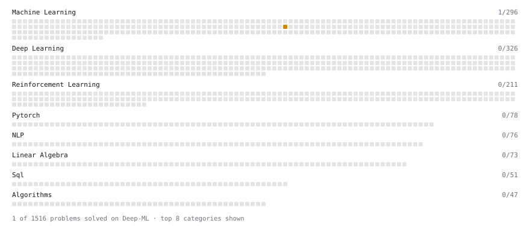

# Deep-ML

My machine learning practice from [Deep-ML](https://www.deep-ml.com). Every solution here was written by hand.

**1** solved · 1 problems · 0 labs · 0 math

[**Browse the interactive portfolio**](https://AdrienBarrau.github.io/deep-ml/) to replay this filling in over time.

## Problems

| | Difficulty | Solved | |
| --- | --- | --- | --- |
| [Behavior Cloning: Learning from Expert Demonstrations](https://www.deep-ml.com/problems/682) | medium | 2026-10-05 | [solution](problems/0682-behavior-cloning-learning-from-expert-demonstrations) |

---

_This file is regenerated by Deep-ML on every push._
